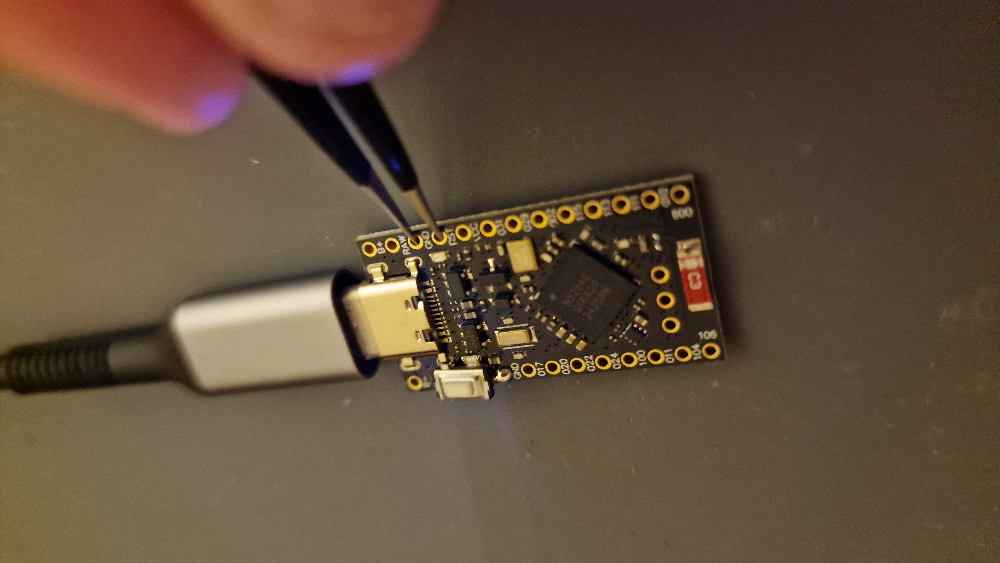
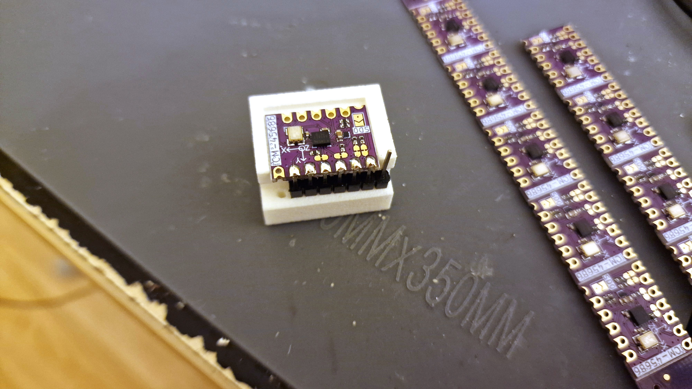
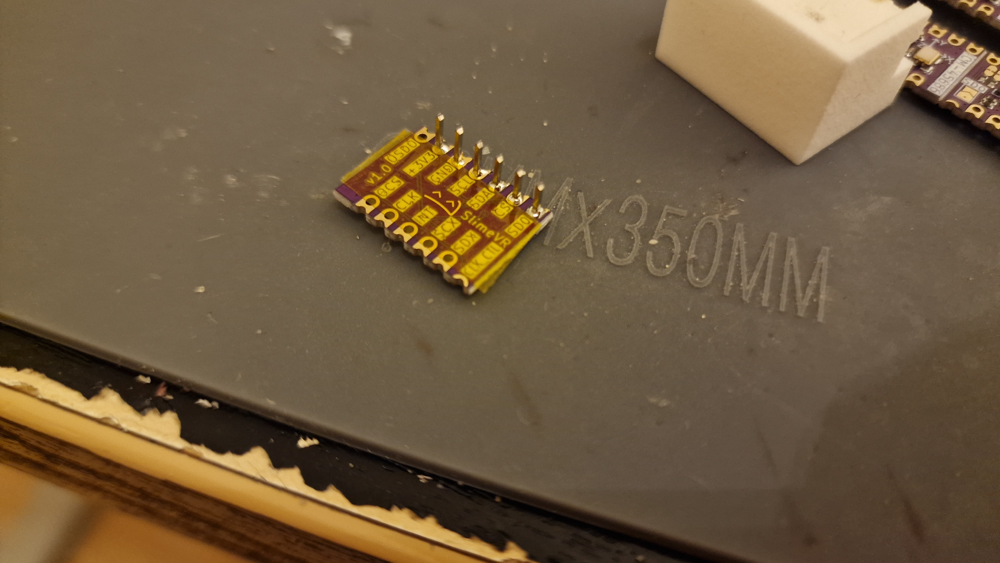
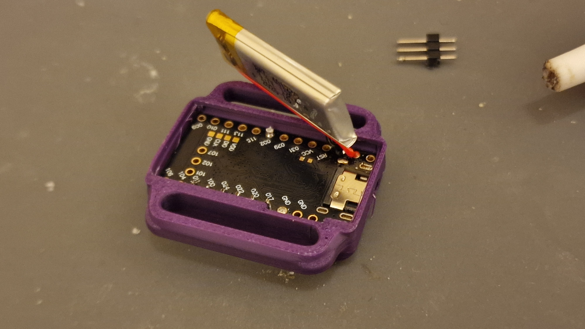
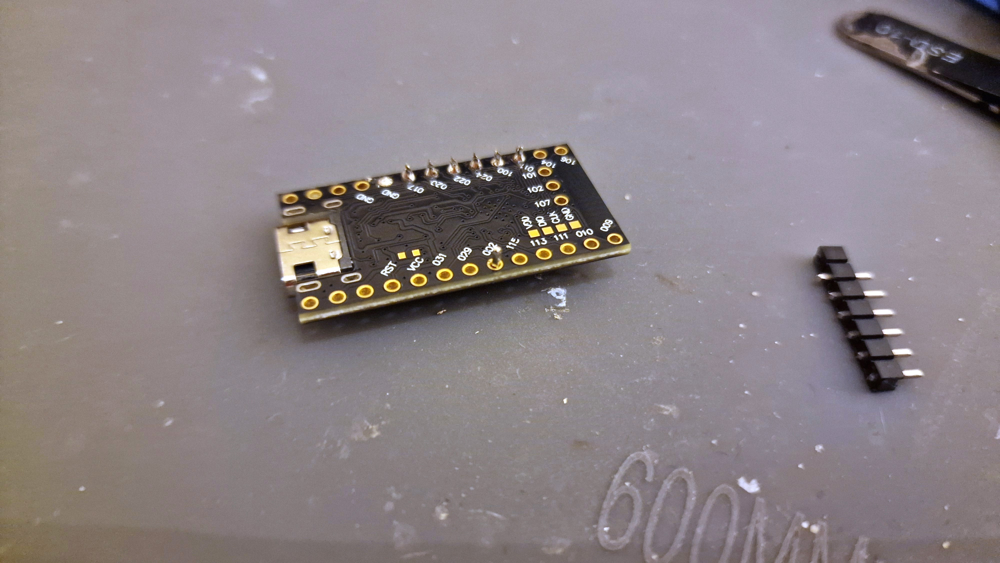
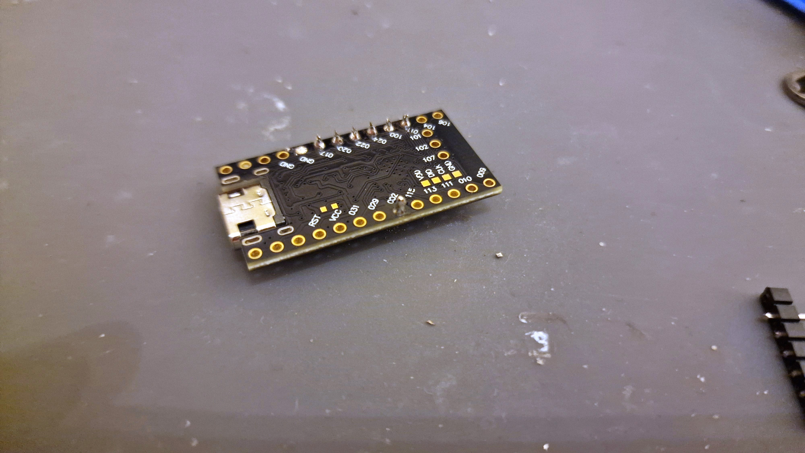

# Smol Stacked SlimeVR Soldering Tutorial

## **[🔗 Visit spiro.ooo](https://spiro.ooo/)**

This guide walks you through preparing your SuperMini NRF52840 board for use in a Smol Stacked SlimeVR tracker. We'll cover board preparation, soldering the reset button, and entering DFU mode to flash firmware.

---

## Prerequisites

Before you begin, make sure you have:

**Electronics:**
- SuperMini NRF52840 development board
- ICM-45686 IMU breakout board
- SMD Button
- 3.7V LiPo battery (120mAh 401230 or similar)
- Header pins (7-pin strip)

**Tools:**
- Soldering iron
- Solder
- Fine-tip tweezers
- Soldering jig for IMU pins (optional but recommended)
- Helping hands or PCB holder
- USB-C data cable

**3D Printed Parts:**
- Miro case (from the STL files in this repository)

**Workspace:**
- Clean, flat work surface
- Good lighting
- Ventilation for soldering fumes

---

## Part 1: Board Overview

### The SuperMini NRF52840

The SuperMini NRF52840 is a compact development board featuring Nordic's nRF52840 SoC. It's perfect for Smol SlimeVR builds due to its small size and power efficiency.

**Key components to identify:**

- **nRF52840 chip** — The large QFN package in the center
- **USB-C port** — For charging, programming, and data
- **Crystal oscillator** — Small gold component near the chip
- **Status LED** — Small red/white component on the edge
- **Pin headers** — Gold-plated holes along both edges (labeled 006, 017, 020, etc.)
- **Reset button pads** — Located near the USB port

---

## Part 2: Soldering the Reset Button

### Step 4: Tack One Corner

With the button positioned correctly, apply a small amount of solder to one pad first. This "tacks" the button in place and allows you to adjust alignment if needed.

### Step 5: Complete the Solder Joints

Use tweezers to position the button correctly; you can use the USB-C port to help guide your tweezers.

Once aligned, solder the remaining pads to secure the button completely.

### Step 6: The Other Side

Push down the button so that the second pin aligns with the pad. Then, solder this pad like normal. Be careful not to damage any components on the board.

---

## Part 3: Testing and Entering DFU Mode

### Step 7: Connect USB-C Cable

Connect your SuperMini to your computer using a USB-C data cable.

### Step 8: Enter DFU Mode

To enter DFU (bootloader) mode for flashing firmware:

1. **Connect the board** to your computer via USB
2. **Use tweezers or a conductive tool** to short the RST pin to GND
3. **Double short RST to GND twice quickly** to reset the board

When successful, you'll see:

- The **red LED will fade or flash solid**
- The board will appear as a **USB mass storage device** (like "NICENANO" or "Feather")

**Note:** Sometimes it takes 2-5 attempts to enter DFU mode. Be patient and try different timing on the double-tap.

### Step 9: Verify DFU Mode

When the board is in DFU mode:

- A new drive will appear on your computer
- The LED behavior will change (typically solid or slowly pulsing)
- You're now ready to flash the bootloader and firmware!

### Step 10: Verify Firmware

After flashing the firmware, connect to the serial terminal to verify the tracker is working. You should see the SlimeVR firmware information and available commands:

### Step 11: Test the Button

Press the reset button to verify it's working correctly. You should see button press events in the serial output:

---

## Troubleshooting

### Board Not Entering DFU Mode

- Try different timing on the double-tap
- Ensure good contact when shorting RST to GND
- Check that your USB cable supports data (not just charging)

### Button Not Working

- Check solder joints for cold joints or bridges
- Verify button orientation
- Test continuity with a multimeter

### USB Not Recognized

- Try a different USB port or cable
- Check for shorts around the USB connector
- Ensure the board was working before modifications

---

## Part 4: Preparing the IMU

Now that your SuperMini is flashed and ready, it's time to prepare the IMU (Inertial Measurement Unit) for stacking.

### Step 10: Gather IMU Components

You'll need:

- ICM-45686 IMU breakout board (purple PCB)
- Header pins (7-pin strip)
- Soldering jig (optional but recommended)

### Step 11: Insert Header Pins into Jig

The soldering jig holds the header pins at the correct height and alignment while you solder. Insert the pins into the jig with the short ends facing up.

### Step 12: Place IMU on Pins

Carefully place the IMU board onto the header pins, ensuring all pins go through the corresponding holes.

### Step 13: Solder IMU Pins

Solder each pin to the IMU board. Work carefully to avoid bridges between adjacent pins.

### Step 14: Remove from Jig

Once all pins are soldered, carefully remove the IMU from the jig.

---

## Part 5: Stacking the IMU onto SuperMini

### Step 15: Prepare for Stacking

Position the IMU above the SuperMini board. The pins from the IMU will go through specific holes on the SuperMini to create the "stacked" configuration.

### Step 16: Solder Stack Connection

Insert the IMU pins through the SuperMini and solder from the bottom side.

**Important Pin Connections:**

- VCC → 3.3V power
- GND → Ground
- SDA → I2C Data
- SCL → I2C Clock
- Additional pins as required by your specific IMU

### Step 17: Verify IMU Connection

Connect to the serial terminal to verify the IMU is detected. You should see sensor status messages indicating the IMU is working:

---

## Part 6: Preparing the Battery

### Step 17: Battery Selection

For the Miro case, use a small LiPo battery. The example shows a 120mAh 3.7V battery (401230 size).

**Battery Specifications:**

- Voltage: 3.7V nominal
- Capacity: 120mAh (varies based on case size)
- Connector: JST or bare wires for direct soldering

### Step 18: Connect Battery Wires

Solder the battery wires to the appropriate pads on the SuperMini:

- **Red wire (positive)** → B+ pad
- **Black wire (negative)** → GND pad

**⚠️ Warning:** Double-check polarity before connecting! Reversed polarity can permanently damage your board.

---

## Part 7: Final Assembly into Miro Case

### Step 19: Prepare the Case

The Miro case features:

- Integrated strap slot for body mounting
- Button access hole
- USB-C port cutout
- Compact design for comfortable wear

### Step 20: Insert the Stack

Carefully place the stacked assembly (SuperMini + IMU) into the case, ensuring:

- USB-C port aligns with the cutout
- Reset button aligns with the access hole
- No wires are pinched

### Step 21: Position the Battery

Tuck the battery into the case alongside or on top of the electronics stack.

### Step 22: Verify Fit

Before closing, verify:

- All components fit without stress
- USB port is accessible
- Button can be pressed
- No shorts between components

### Step 23: Install the Battery

Place the battery on top of the electronics stack, with wires routed neatly to avoid pinching.

### Step 24: Close the Case

Snap the lid onto the case. The Miro case lid features:

- **SPIRO.OOO branding** with diagonal stripe pattern
- **Embossed logo** on the top surface
- **Button access hole** for reset functionality
- **USB-C cutout** for charging access

**Congratulations!** Your Miro case Smol Stacked SlimeVR tracker is now fully assembled!

---

## Next Steps

Your Smol Stacked SlimeVR tracker is now assembled! Next steps:

1. **Flash the bootloader** — Copy the bootloader .uf2 file to the mounted drive
2. **Flash tracker firmware** — After bootloader, flash the SlimeVR tracker firmware
3. **Pair with receiver** — Connect your tracker to your SlimeVR receiver/dongle
4. **Calibrate** — Follow the SlimeVR calibration process
5. **Attach straps** — Thread straps through the case slots and wear!

For firmware flashing instructions, see the [SlimeVR Smol Slime Documentation](https://docs.slimevr.dev/smol-slimes/).

---

## Related Resources

- [SlimeVR Documentation](https://docs.slimevr.dev/)
- [Smol Slime Hardware Guide](https://docs.slimevr.dev/smol-slimes/hardware/smol-tracker.html)
- [SlimeVR Discord](https://discord.gg/SlimeVR)

---

*Tutorial by spiro.ooo — Made with ❤️ for the SlimeVR community*
