# Smol Stacked SlimeVR Soldering Tutorial

## **[🔗 Want to buy these instead? Visit spiro.ooo](https://spiro.ooo/)**

This guide walks you through preparing your SuperMini NRF52840 board for use in a Smol Stacked SlimeVR tracker. We'll cover board preparation, soldering the reset button, and entering DFU mode to flash firmware.

---

## Prerequisites

Before you begin, make sure you have:

**Electronics:**
- SuperMini NRF52840 development board
- ICM-45686 IMU breakout board
- SMD Button
- 3.7V LiPo battery (120mAh 401230 or similar)
- Header pins (7-pin strip)

**Tools:**
- Soldering iron
- Solder
- Fine-tip tweezers
- Soldering jig for IMU pins (optional but recommended)
- Helping hands or PCB holder
- USB-C data cable

**3D Printed Parts:**
- Miro case (from the STL files in this repository)

**Workspace:**
- Clean, flat work surface
- Good lighting
- Ventilation for soldering fumes

---

## Part 1: Board Overview

### The SuperMini NRF52840

The SuperMini NRF52840 is a compact development board featuring Nordic's nRF52840 SoC. It's perfect for Smol SlimeVR builds due to its small size and power efficiency.

**Key components to identify:**

- **nRF52840 chip** — The large QFN package in the center
- **USB-C port** — For charging, programming, and data
- **Crystal oscillator** — Small gold component near the chip
- **Status LED** — Small red/white component on the edge
- **Pin headers** — Gold-plated holes along both edges (labeled 006, 017, 020, etc.)
- **Reset button pads** — Located near the USB port

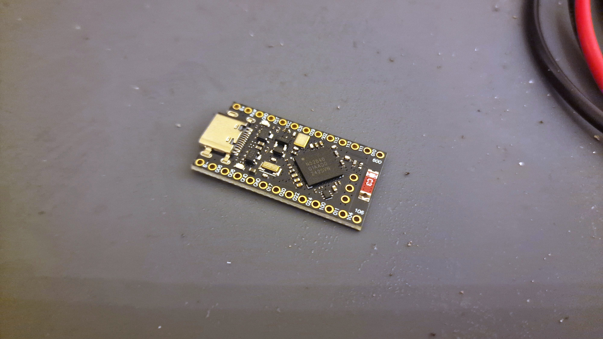

---

## Part 2: Soldering the Reset Button

### Tack One Corner

With the button positioned correctly, apply a small amount of solder to one pad first. This "tacks" the button in place and allows you to adjust alignment if needed.

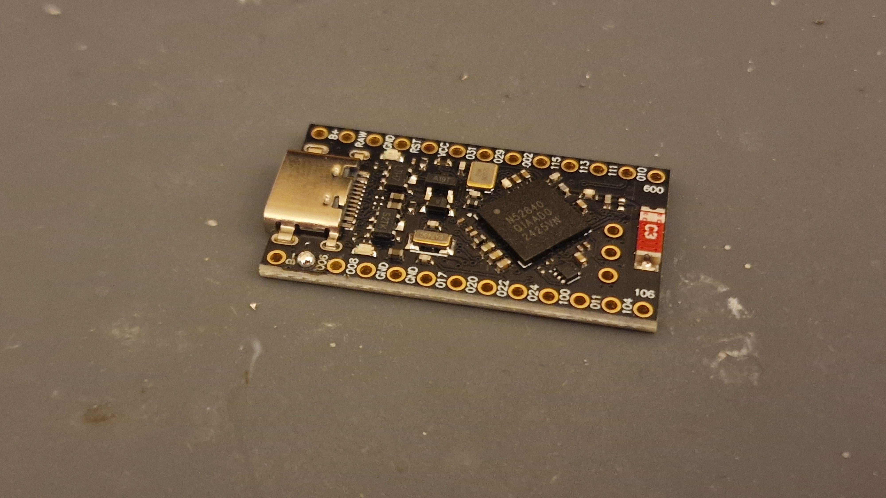

### Complete the Solder Joints

Use tweezers to position the button correctly; you can use the USB-C port to help guide your tweezers.

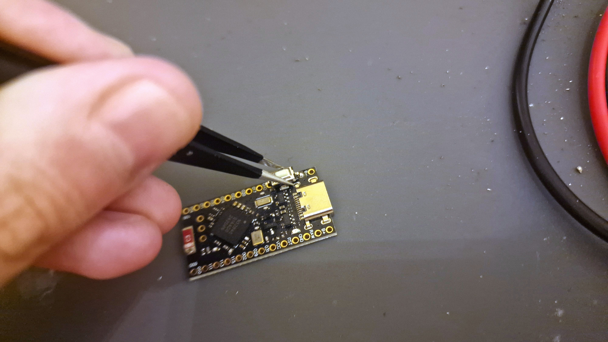

Once aligned, solder the remaining pads to secure the button completely.

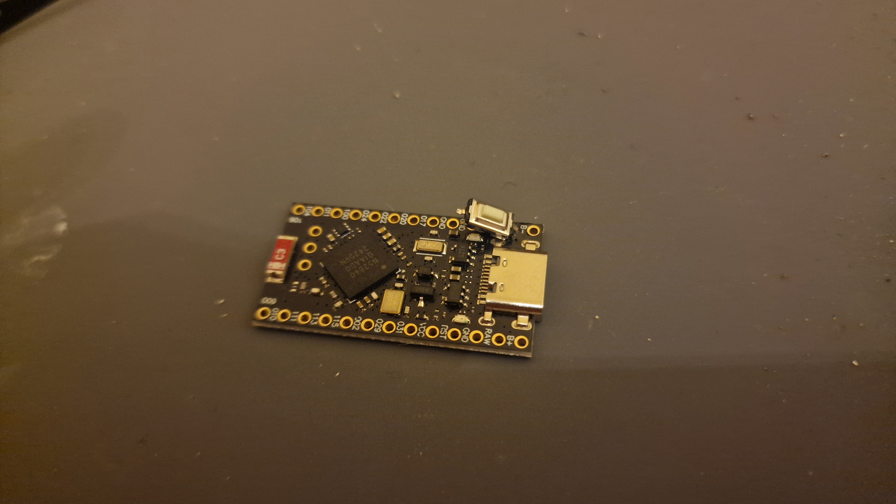

### The Other Side

Push down the button so that the second pin aligns with the pad. Then, solder this pad like normal. Be careful not to damage any components on the board.

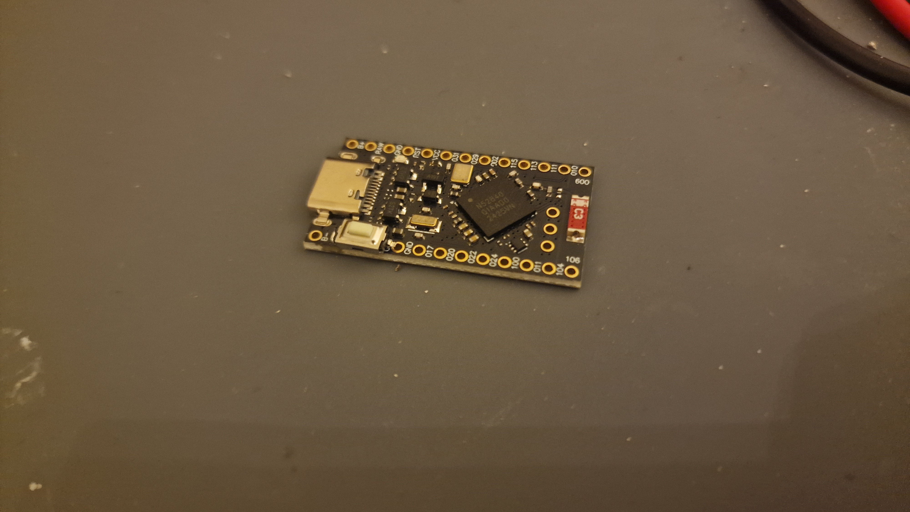

---

## Part 3: Testing and Entering DFU Mode

### Connect USB-C Cable

Connect your SuperMini to your computer using a USB-C data cable.

### Enter DFU Mode

To enter DFU (bootloader) mode for flashing firmware:

1. **Connect the board** to your computer via USB
2. **Use tweezers or a conductive tool** to short the RST pin to GND
3. **Double short RST to GND twice quickly** to reset the board

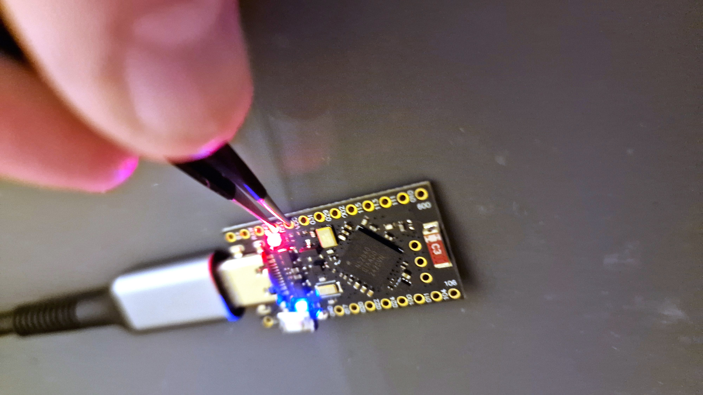

When successful, you'll see:

- The **red LED will fade or flash solid**
- The board will appear as a **USB mass storage device** (like "NICENANO" or "Feather")

**Note:** Sometimes it takes 2-5 attempts to enter DFU mode. Be patient and try different timing on the double-tap.

### Flashing the Firmware

## For information on flashing the firmware, please refer to the information found in the SlimeVR Documentation [Here](https://docs.slimevr.dev/smol-slimes/firmware/index.html)

### Verify Firmware

After flashing the firmware, connect to the serial terminal to verify the tracker is working. I recommend Spacehuhn's web terminal implementation found [Here](https://terminal.spacehuhn.com/).

You should see the SlimeVR firmware information and available commands:

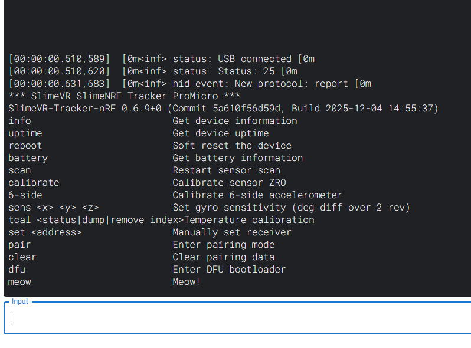

### Test the Button

Press the reset button to verify it's working correctly. You should see button press events in the serial output:

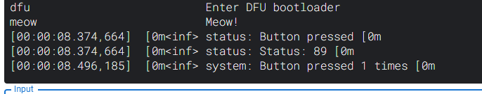

---

## Troubleshooting

### Board Not Entering DFU Mode

- Try different timing on the double-tap
- Ensure good contact when shorting RST to GND
- Check that your USB cable supports data (not just charging)

### Button Not Working

- Check solder joints for cold joints or bridges
- Verify button orientation
- Test continuity with a multimeter

### USB Not Recognized

- Try a different USB port or cable
- Check for shorts around the USB connector

---

## Part 4: Preparing the IMU

Now that your SuperMini is flashed and ready, it's time to prepare the IMU for soldering.

### Gather IMU Components

You'll need:

- ICM-45686 IMU breakout board
- Header pins
- My modified [Bris Ibis](https://github.com/brisfknibis/ibis-trackers) Solder Cube, found [Here](../STL/Modified%20Solder%20Cube.stl)

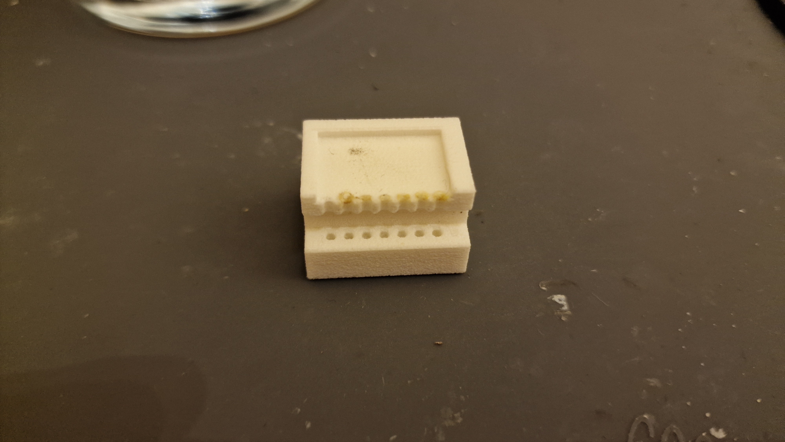

### Insert Header Pins into Jig

The soldering jig holds the header pins at the correct height and alignment while you solder. Insert the pins into the jig with the short ends facing up. The taller pin that's been pushed up will be used later.

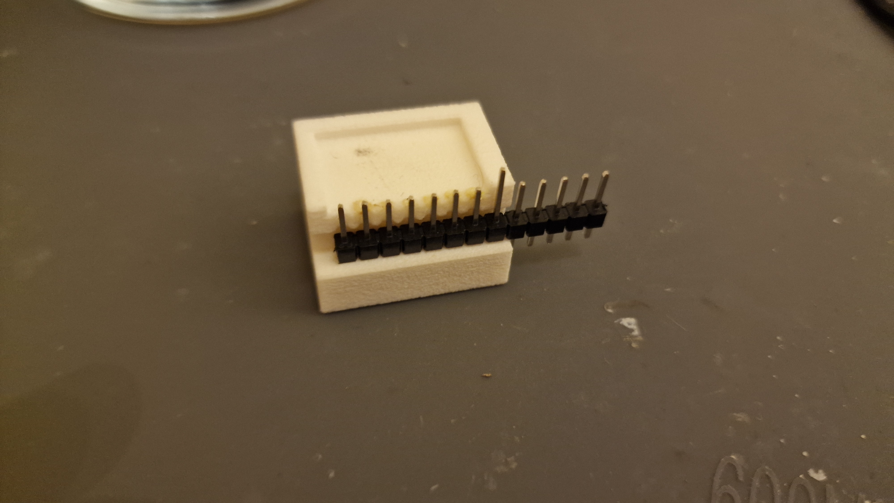

### lace IMU on Pins

Carefully place the IMU board onto the header pins, ensuring all pins go through the corresponding holes.

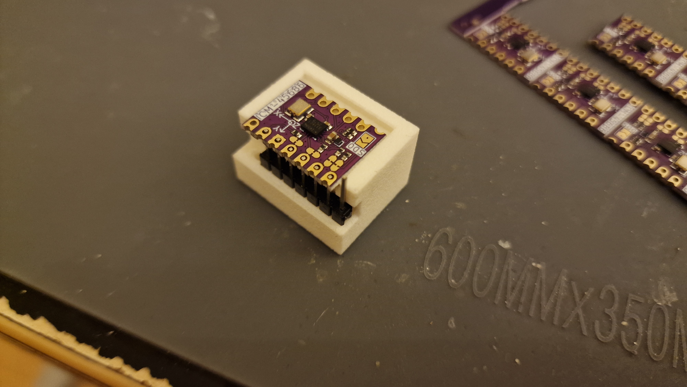

### Solder IMU Pins

Solder each pin to the IMU board. Work carefully to avoid bridges between adjacent pins.

### Remove from Jig

Once all pins are soldered, carefully remove the IMU from the jig using your clippers.

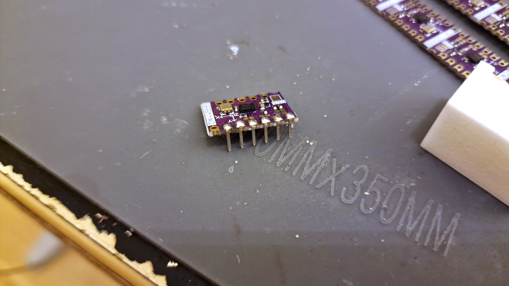

### Kapton Tape

Place Kapton Tape onto the rear of the board to prevent shorts. Optional, but highly recommended.
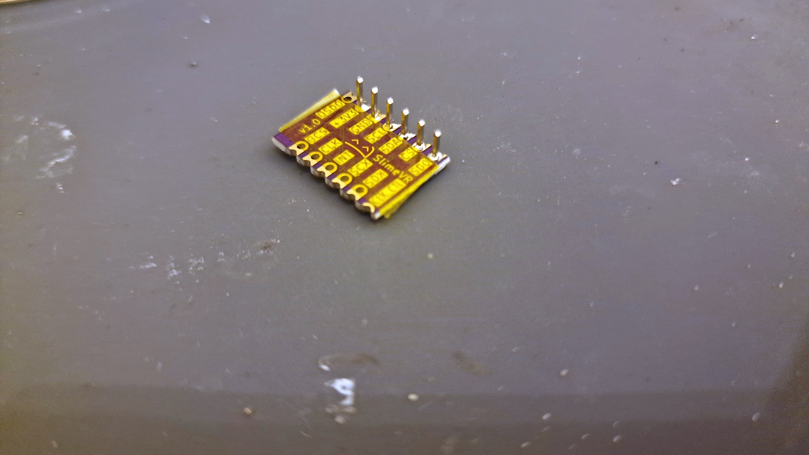

---

## Part 5: Stacking the IMU onto SuperMini

### Prepare for Stacking

Position the IMU above the SuperMini board. The pins from the IMU will go through specific holes on the SuperMini to create the "stacked" configuration.

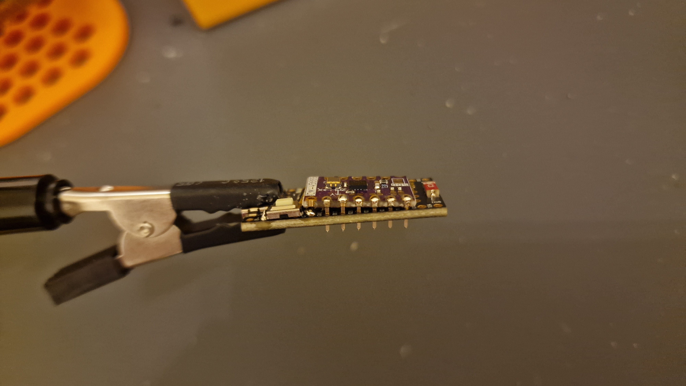

### Solder Stack Connection

Solder all the exposed pins, ensuring clean joints.

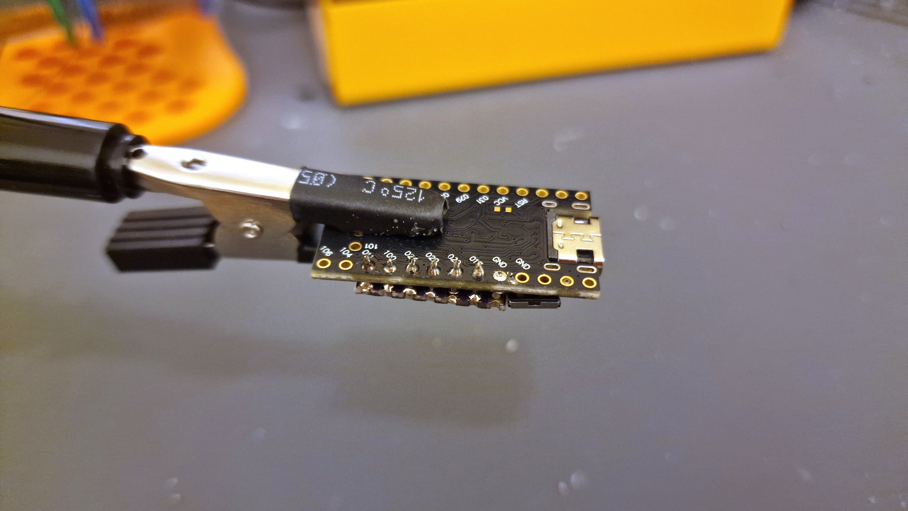

### Verify IMU Connection

Connect to the serial terminal to verify the IMU is detected. You should see sensor status messages indicating the IMU is working:

## Connect INT Pin

Use the extended header pin from earlier at Pin 002 on the SuperMini.

Then, use a tool of your choice to push the pin into place, connecting to the INT pin on the IMU.

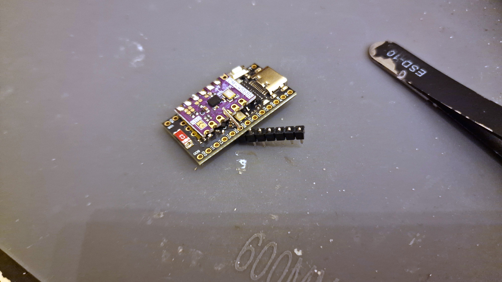

---

## Part 6: Preparing the Battery

### Step 17: Battery Selection

For the Miro case, use a small LiPo battery. The example shows a 120mAh 3.7V battery (401230 size).

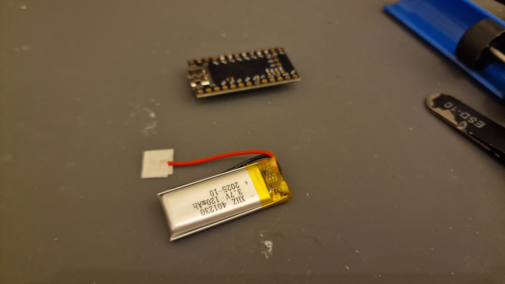

### Step 18: Connect Battery Wires

Solder the battery wires to the appropriate pads on the SuperMini:

- **Red wire (positive)** → RAW Pad
- **Black wire (negative)** → GND Pad

**⚠️ Warning:** Double-check polarity before connecting! Reversed polarity can permanently damage your board.

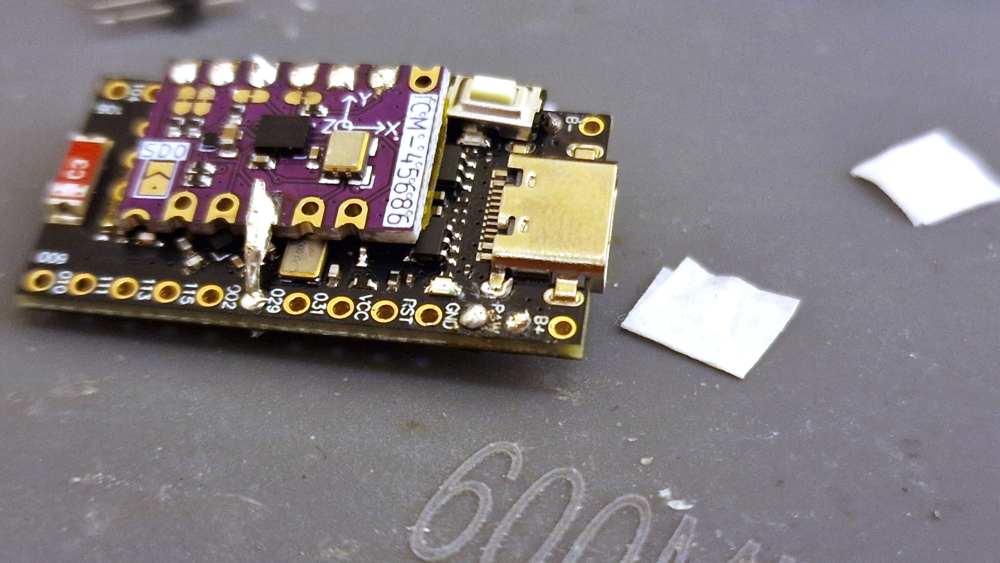

After this is done, you're all ready to insert the board inside the case.

---

## Part 7: Final Assembly into Miro Case

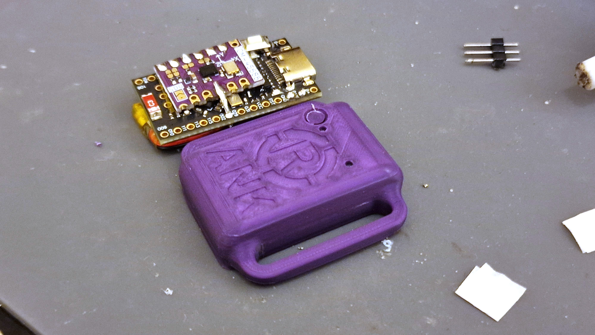

### Insert the Board

Carefully place the stacked assembly (SuperMini + IMU) into the case, ensuring:

- USB-C port aligns with the cutout
- The button aligns with the access hole
- No wires are pinched

Push down on the USB Side of the board first, then push firmly on the opposite side.

**⚠️ Warning:** Do **NOT** push down on the battery itself. If you do, you risk causing a fire.

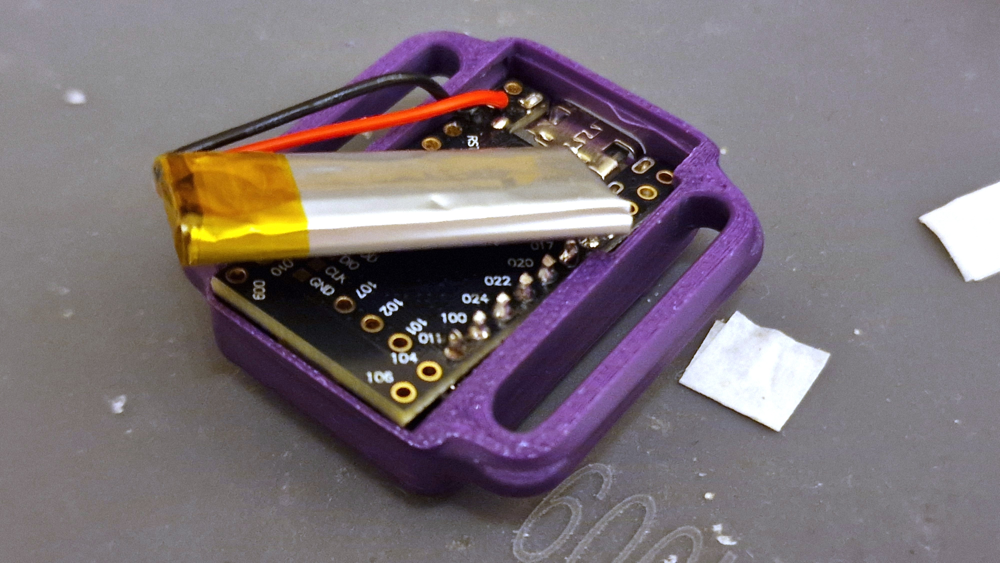

### Position the Battery

Tuck the battery into the case alongside or on top of the electronics stack.

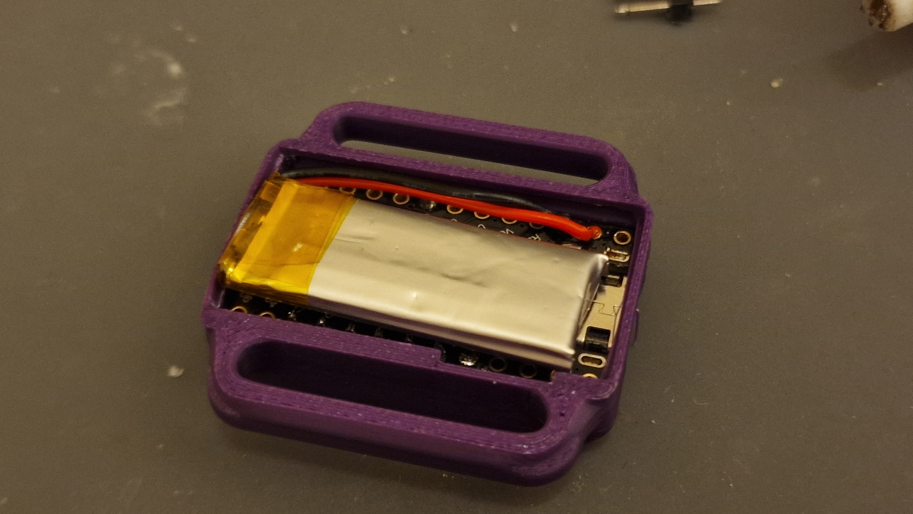

### Verify Fit

Ensure that:

- All components fit without stress
- USB port is accessible
- Button can be pressed
- No shorts between components

### Step 24: Close the Case

Snap the lid onto the case. That's it!

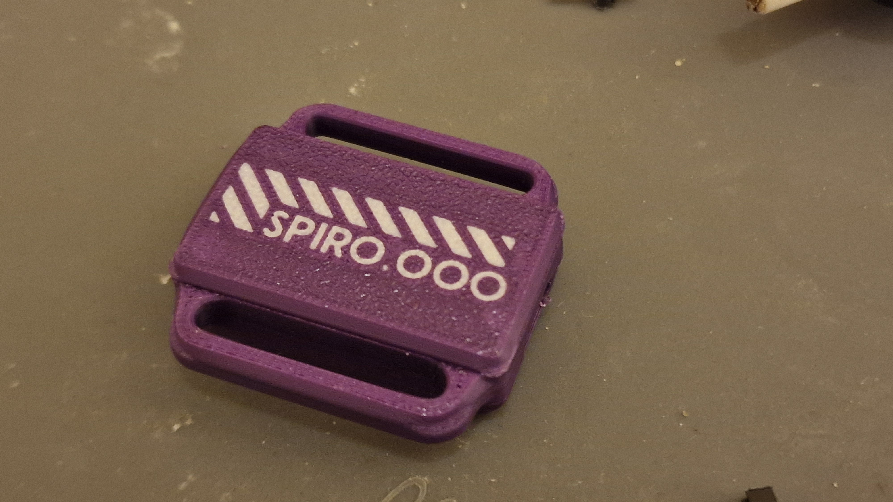

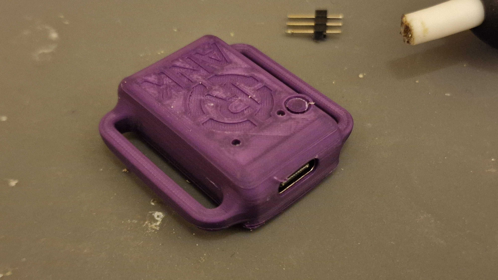

**Congratulations!** Your Miro case Smol Stacked SlimeVR tracker is now fully assembled!

---

## Next Steps

Your Smol Stacked SlimeVR tracker is now assembled! Next steps:

3. **Pair with receiver** — [Connect your tracker to your SlimeVR receiver/dongle](https://docs.slimevr.dev/smol-slimes/firmware/smol-pairing-and-calibration.html)
4. **Calibrate** — [Follow the SlimeVR calibration process](https://docs.slimevr.dev/quick-setup.html)
5. **Attach straps** — Thread straps through the case slots and wear!

---

## Related Resources

- [SlimeVR Documentation](https://docs.slimevr.dev/)
- [Smol Slime Hardware Guide](https://docs.slimevr.dev/smol-slimes/hardware/smol-tracker.html)
- [SlimeVR Discord](https://discord.gg/SlimeVR)

---

*Tutorial by spiro.ooo — Made with ❤️ for the SlimeVR community*
