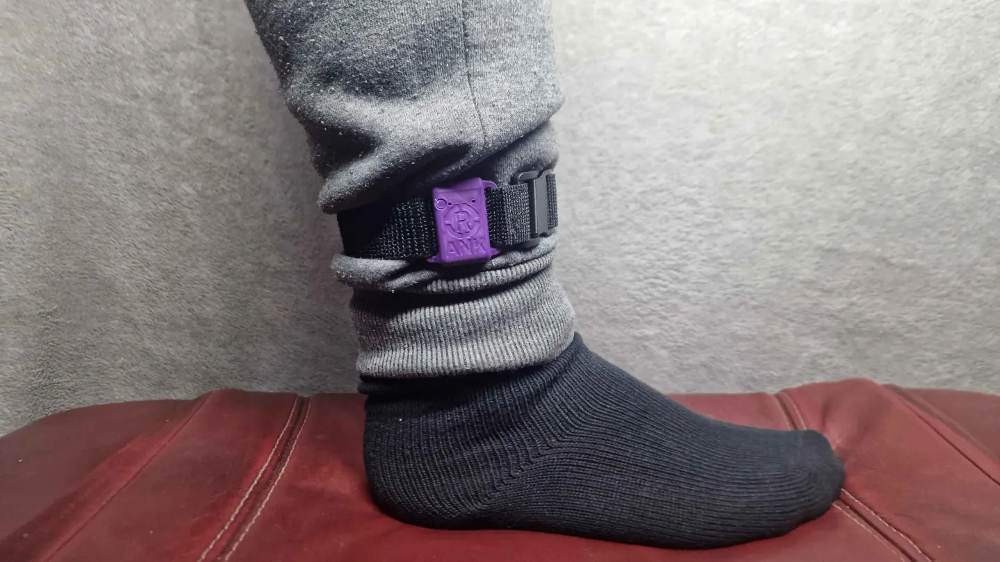
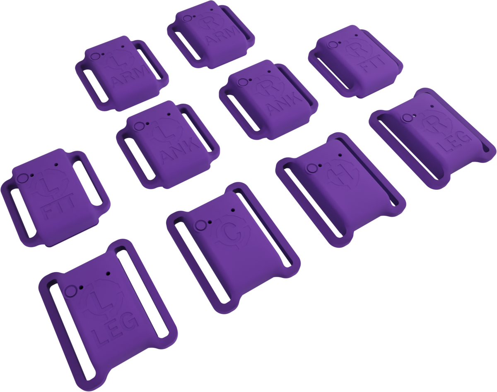

# Miro Cases

## **[Available now at https://spiro.ooo/](https://spiro.ooo/)**




3D printable cases designed for **Smol Stacked SlimeVR** trackers.


## Need Help?

Contact me on Discord @spiro.ooo or search for Miro trackers in the SlimeVR Discord.

## About

Miro Cases are custom enclosures for the Smol Slime (nRF) tracker configuration in a stacked layout. These cases are designed to house the compact nRF52-based SlimeVR trackers that use Enhanced ShockBurst (ESB) protocol for highly power-efficient full-body tracking in VR.

## What are Smol Stacked SlimeVR Trackers?

Smol Slimes (also known as nRF Trackers) are a newer generation of SlimeVR trackers that offer significant advantages over traditional ESP/WiFi-based trackers:

- **Ultra-low power consumption** - can run for days or weeks on a small battery
- **Compact form factor** - much smaller than WiFi-based trackers
- **Stacked configuration** - components are layered vertically to minimize footprint
- **Requires a receiver/dongle** - communicates with SlimeVR Server via a heavily modified ESB protocol

## Contents

```
miro-cases/
├── STL/           # 3D printable STL files
├── LICENSE        # License information
└── README.md      # This file
```

## Printing Guidelines

### Recommended Settings

| Setting | Value |
|---------|-------|
| Layer Height | 0.2mm |
| Infill | 15-20% |
| Supports | Automatic is OK, but recommend manual supports |
| Material | PLA, PETG |

### Tips

- Print a test fit before committing to a full set
- Ensure your printer is calibrated for accurate tolerances
- Some parts may require light sanding for a perfect fit

## Compatible Components

These cases are designed for Smol Stacked SlimeVR builds, which typically include:

- **MCU**: SuperMini NRF52840
- **IMU**: Various supported sensors (Primarily ICM-45686)
- **Battery**: Small LiPo cells appropriate for the case dimensions (401230)

## 🔧 Assembly 🔧

1. Print all required case components
2. Assemble your Smol Stacked tracker electronics
3. Install the electronics into the case
4. Secure with the lid/cover
5. Attach straps as needed

[For an in-depth guide on how to build your own Miro trackers, follow the tutorial here.](./Documentation/SOLDERING_TUTORIAL.md)

## Related Resources

- [SlimeVR Documentation](https://docs.slimevr.dev/)
- [Smol Slime Documentation](https://docs.slimevr.dev/smol-slimes/index.html)
- [SlimeVR Discord](https://discord.gg/SlimeVR)
- [Community-built Cases](https://docs.slimevr.dev/diy/cases.html)

## 🧡 Contributing 🧡

Contributions are welcome! If you have improvements or variations:

1. Fork this repository
2. Create your feature branch
3. Submit a pull request

## License

<a href="https://creativecommons.org/licenses/by-nc-sa/4.0/">
  
  
  
  
</a>

Licensed under [CC BY-NC-SA 4.0](https://creativecommons.org/licenses/by-nc-sa/4.0/).
See the [LICENSE](LICENSE) file for details.

## Acknowledgments

- The SlimeVR community for their incredible open-source work
- All contributors to the Smol Slime project
- The VR full-body tracking community
- And my good friend Redele for the original Miro cases and for being so patient with me

---

*Made with ❤️ for the SlimeVR community*
